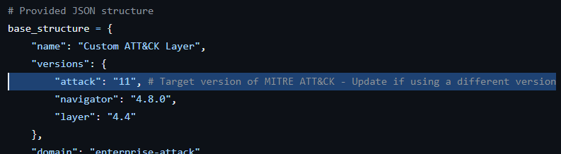
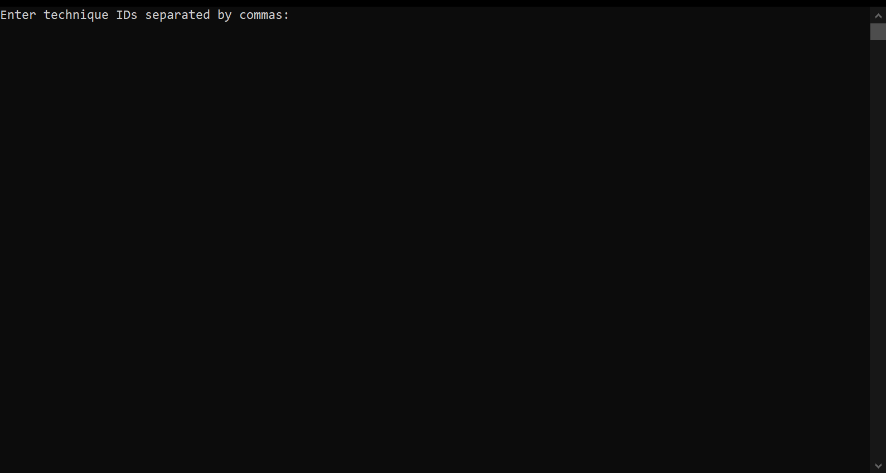
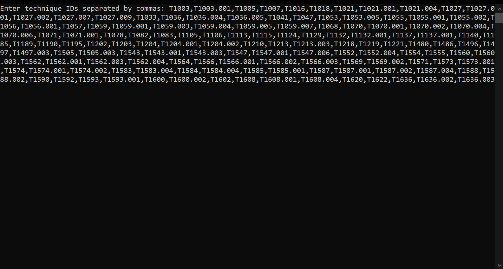
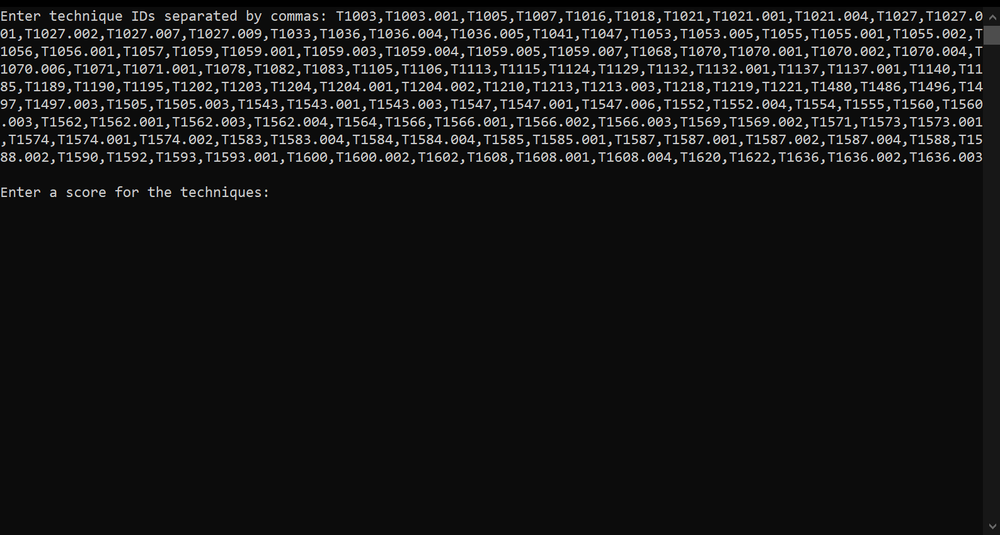
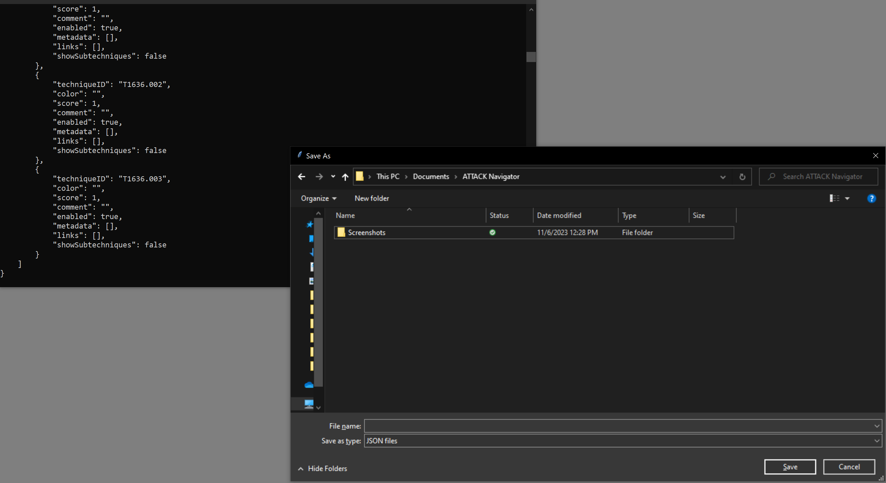

# attack_layer_builder

## Description
The attack_layer_builder is a Python script designed for threat intelligence analysts working with the MITRE ATT&CK framework. It allows users to generate a JSON file formatted specifically for the MITRE ATT&CK Navigator. By inputting a list of technique IDs and an associated score, the script creates a "layer" file that can be uploaded directly to the ATT&CK Navigator, thereby enabling the creation of custom heatmaps for threat analysis.

## Compatibility
The script is currently set up for version 11 of the MITRE ATT&CK framework. To use the script with the latest version (version 14 as of this writing), you will need to update the `versions` dictionary within the script to match the version of the ATT&CK framework you are working with.


*Figure: The highlighted section indicates where to update the version in the script.*

## Features
- Easy generation of ATT&CK Navigator layer JSON files from a list of technique IDs.
- Custom scoring for each technique to reflect relevance or impact.
- Simple command-line interface with additional GUI for saving the output.

## Prerequisites
- Python 3.x
- Tkinter library (usually included with Python)

## Installation
Clone the repository to your local machine using the following command:

```git clone https://github.com/markmackensen/attack_layer_builder.git```

Navigate to the script directory:

```cd attack_layer_builder```

## Usage
Run the script using Python:

```python attack_layer_builder.py```

When prompted, enter the technique IDs separated by commas, followed by the score you want to assign to these techniques. The script will then generate the JSON output and open a file dialog allowing you to save the result as a .json file.

### Screenshots

#### Initial Prompt

*Figure 1: The initial command-line interface prompt where the user is expected to input the technique IDs, separated by commas.*

#### Technique IDs Entered

*Figure 2: The CLI displaying entered technique IDs.*

#### Score Prompt

*Figure 3: The CLI prompt asking for a score to be assigned to the entered technique IDs.*

#### Save As Dialog

*Figure 4: The "Save As" dialog window for saving the JSON output file.*

#### JSON File Example

*Figure 5: Example of the generated JSON file as it appears when opened.*

### Contributing
Contributions to the attack_layer_builder are welcome! Before creating a pull request or issue, please check for existing issues or enhancement requests. If you have a suggestion that would make this better, please fork the repo and create a pull request, or open a new issue with the appropriate tag.
Don't forget to give the project a star! Thanks again!

### License
This project is licensed under the MIT License - see the [LICENSE](LICENSE.md) file for details.

### Acknowledgments
Thanks to the MITRE Corporation for the ATT&CK framework.
This project is not affiliated with or endorsed by MITRE.

### Contact Information
For any queries or issues, please open an issue on the GitHub repository issue tracker.
