# attack_layer_builder

## Description
The attack_layer_builder is a Python script designed for threat intelligence analysts working with the MITRE ATT&CK framework. This enhanced version allows users to generate a JSON file formatted for the MITRE ATT&CK Navigator. Users can input technique IDs either manually or through a CSV file and assign a custom score. The script then creates a "layer" file for custom heatmaps in the ATT&CK Navigator, thereby enabling the creation of custom heatmaps for threat analysis.

## Compatibility
This script supports version 14 (default) of the MITRE ATT&CK framework, with an option to select earlier versions between 4 and 14. Users can input their desired version when prompted. Remember that only layers of the same domain and version can be merged, if you plan to use the "Create Layer from Other Layers" option in Navigator.

## Features
- Generate ATT&CK Navigator layer JSON files using technique IDs from manual input or a CSV file.
- Assign custom scores to each technique, reflecting their relevance or impact.
- User-friendly command-line interface, enhanced with Tkinter GUI for file operations.
- Technique ID validation ensures input conforms to the MITRE ATT&CK format.
- Error handling for CSV and JSON file operations, improving script robustness.
- Logging of key actions and errors for better tracking and debugging.
- Default version setting for the ATT&CK Navigator, enhancing usability.

## Prerequisites
- Python 3.x
- Tkinter library (usually included with Python)

## Installation
Clone the repository to your local machine using the following command:

```git clone https://github.com/markmackensen/attack_layer_builder.git```

Navigate to the script directory:

```cd attack_layer_builder```

## Usage
Run the script using Python:

```python attack_layer_builder.py```

Follow the prompts to input technique IDs and score. The script supports both manual input and CSV file selection for technique IDs. After generating the JSON output, a file dialog allows you to save the result as a .json file, ready for upload to the ATT&CK Navigator.

### Screenshots

#### CSV File Selection Process
This section illustrates the process of selecting a CSV file, from the initial prompt to saving the generated JSON file.
  
##### Initial Prompt
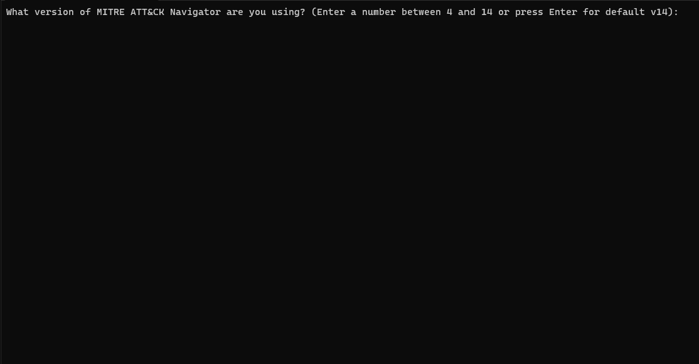
*Figure 1: The initial prompt asking for the version of MITRE ATT&CK Navigator.*

##### CSV or Technique ID Selection
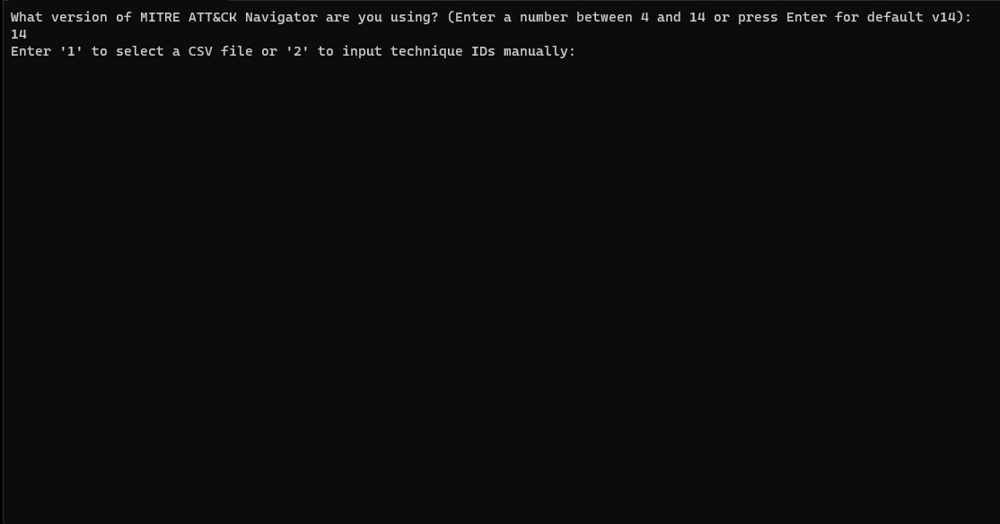
*Figure 2: Prompt to choose between CSV file upload or manual technique ID input.*

##### CSV Selection
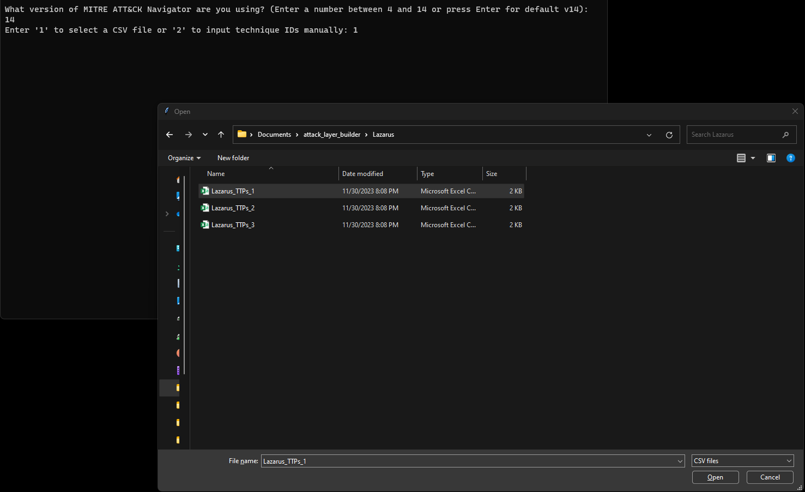
*Figure 3: Dialog window for selecting a CSV file.*

##### CSV Score Prompt
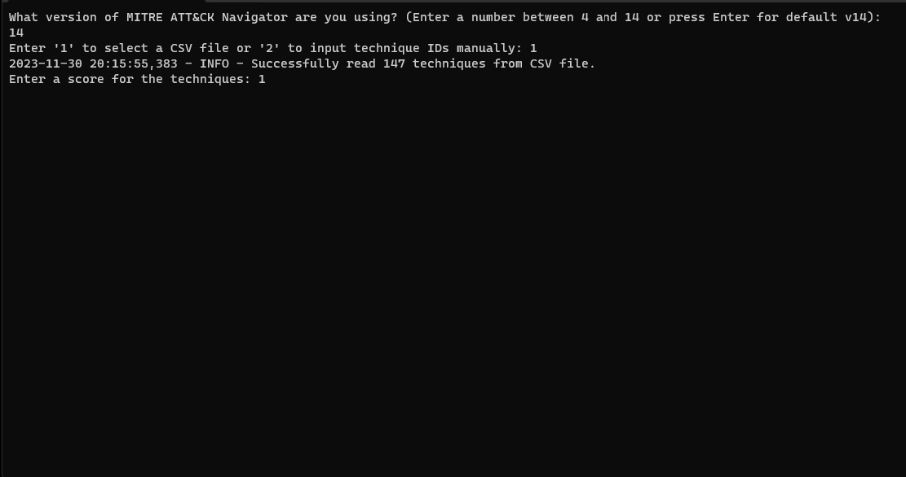
*Figure 4: Prompt for entering a score after selecting a CSV file.*

##### Save As Dialog
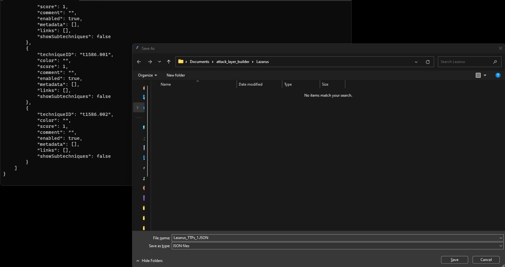
*Figure 5: "Save As" dialog window for saving the generated JSON file.*

##### Script Exit
<p align="left">
  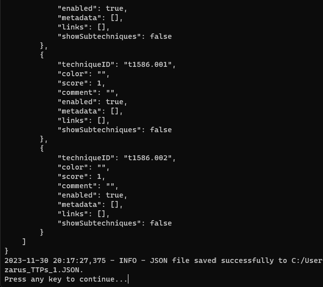
  <br>
  <em>Figure 6: Confirmation message displaying successful save and prompt to exit.</em>
</p>

#### Manual Technique ID Input
This section shows the process when manually entering technique IDs and assigning a score.

##### Manual Technique IDs Entered
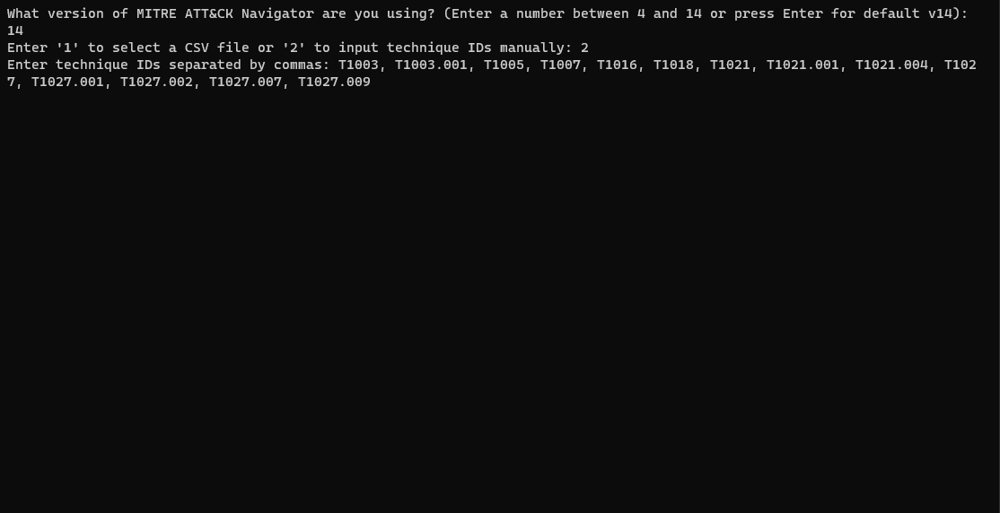
*Figure 7: Manual entry of technique IDs.*

##### Technique Score Prompt
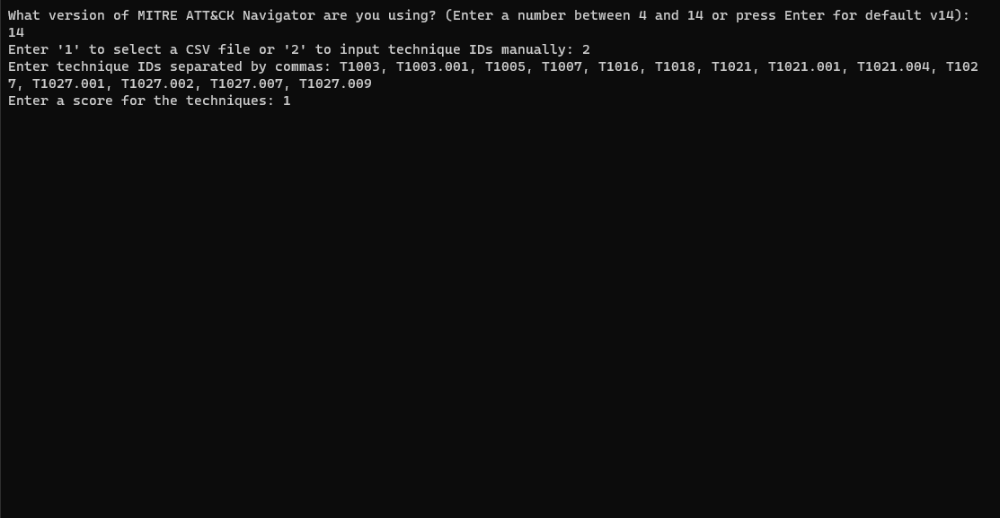
*Figure 8: Prompt for entering a score for manually entered technique IDs.*

#### Error Handling and Invalid Entries
This section highlights examples of error messages for invalid inputs.

##### Invalid Technique IDs
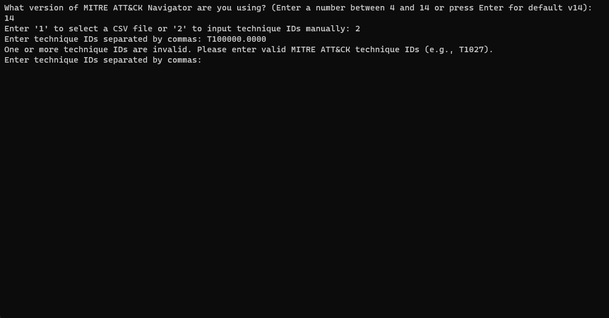
*Figure 9: Error message displayed for invalid technique IDs.*

##### Invalid Navigator Version
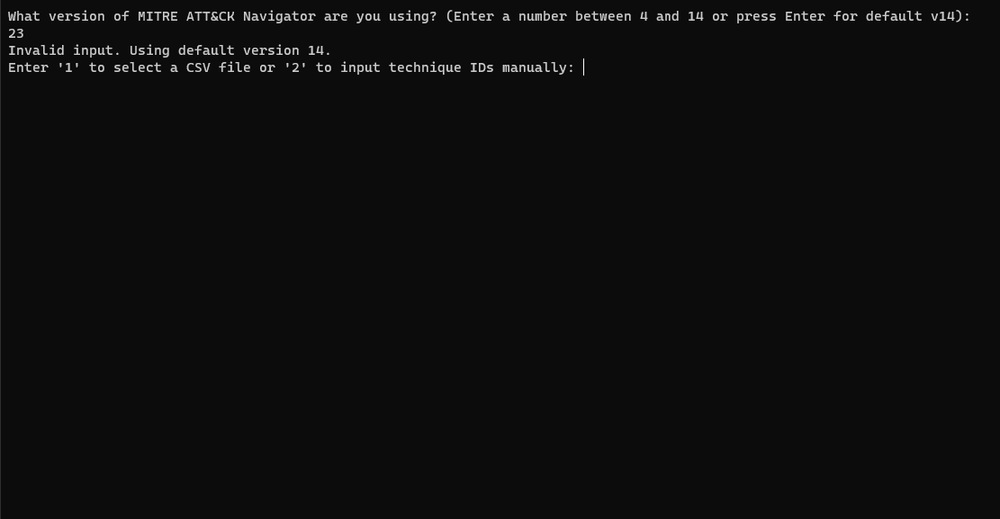
*Figure 10: Error message displayed for invalid MITRE ATT&CK Navigator version input.*

##### Invalid Score
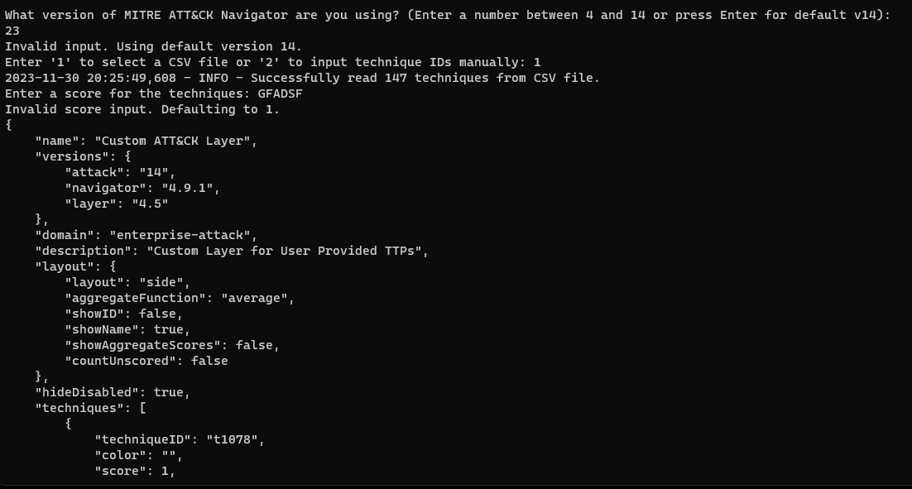
*Figure 11: Error message displayed for invalid score input.*

### Contributing
Contributions are welcome! Before creating a pull request or issue, please check for existing issues or enhancement requests. If you have a suggestion that would make this better, please fork the repo and create a pull request, or open a new issue with the appropriate tag.
Don't forget to give the project a star! Thanks again!

### License
This project is licensed under the MIT License - see the [LICENSE](LICENSE.md) file for details.

### Acknowledgments
Thanks to the MITRE Corporation for the ATT&CK framework.
This project is not affiliated with or endorsed by MITRE.

### Contact Information
For any queries or issues, please open an issue on the GitHub repository issue tracker.

### Connect with Me

I'm always open to interesting conversations and opportunities. Let's connect!

[](https://www.linkedin.com/in/mark-mackensen/)

